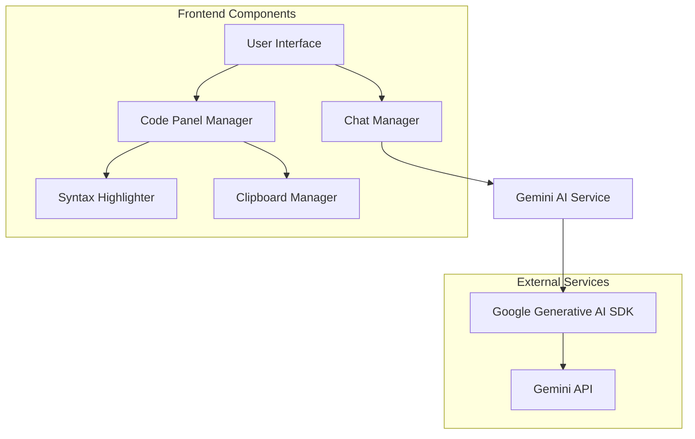

# Design Document

## Overview

The Gemini Chat App is a single-page web application that provides an intuitive chat interface for interacting with Google's Gemini AI. The application features automatic code parsing, syntax highlighting, and a responsive dark theme design. Built with vanilla JavaScript and modern web standards, it offers a lightweight yet powerful development tool.

## Architecture

### High-Level Architecture



### Component Structure

- **App Controller**: Main application orchestrator
- **Chat Manager**: Handles message flow and UI updates
- **Code Panel Manager**: Parses responses and manages code display
- **Gemini Service**: Wraps AI API interactions
- **UI Components**: Modular interface elements

## Components and Interfaces

### 1. App Controller (`app.js`)
**Responsibilities:**
- Initialize application and dependencies
- Coordinate between chat and code panel managers
- Handle global error states

**Key Methods:**
```javascript
class AppController {
    async init()
    handleError(error)
    setupEventListeners()
}
```

### 2. Chat Manager (`chatManager.js`)
**Responsibilities:**
- Manage chat UI state and message rendering
- Handle user input and message submission
- Coordinate with Gemini service for responses

**Key Methods:**
```javascript
class ChatManager {
    addMessage(content, isUser)
    async sendMessage(message)
    scrollToBottom()
    renderMessage(message, isUser)
}
```

### 3. Code Panel Manager (`codePanelManager.js`)
**Responsibilities:**
- Parse AI responses for code blocks
- Create and manage code panels
- Handle panel interactions (resize, collapse, copy)

**Key Methods:**
```javascript
class CodePanelManager {
    parseCodeBlocks(text)
    createCodePanel(code, language, filename)
    setupPanelControls(panel)
    copyToClipboard(content)
}
```

### 4. Gemini Service (`geminiService.js`)
**Responsibilities:**
- Initialize and configure Gemini AI client
- Handle API requests and responses
- Manage error states and retries

**Key Methods:**
```javascript
class GeminiService {
    constructor(apiKey)
    async generateResponse(prompt)
    handleApiError(error)
}
```

### 5. Syntax Highlighter (`syntaxHighlighter.js`)
**Responsibilities:**
- Detect programming languages from code blocks
- Apply appropriate syntax highlighting
- Support common languages (JavaScript, Python, HTML, CSS, etc.)

**Key Methods:**
```javascript
class SyntaxHighlighter {
    highlight(code, language)
    detectLanguage(code)
    escapeHtml(text)
}
```

## Data Models

### Message Model
```javascript
class Message {
    constructor(content, isUser, timestamp) {
        this.content = content;
        this.isUser = isUser;
        this.timestamp = timestamp;
        this.id = generateId();
    }
}
```

### Code Block Model
```javascript
class CodeBlock {
    constructor(code, language, filename) {
        this.code = code;
        this.language = language || 'text';
        this.filename = filename || 'untitled';
        this.id = generateId();
    }
}
```

### Panel State Model
```javascript
class PanelState {
    constructor(id) {
        this.id = id;
        this.isCollapsed = false;
        this.width = 'auto';
        this.height = 'auto';
    }
}
```

## Error Handling

### API Error Handling
- **Network Errors**: Display retry option with exponential backoff
- **Authentication Errors**: Show clear API key configuration message
- **Rate Limiting**: Implement queue with user feedback
- **Invalid Responses**: Graceful degradation with error message

### UI Error Handling
- **Code Parsing Errors**: Log errors, display raw text as fallback
- **Clipboard Errors**: Show temporary notification of copy failure
- **Responsive Layout Issues**: CSS fallbacks for unsupported features

### Error Recovery Strategies
```javascript
class ErrorHandler {
    handleApiError(error) {
        switch(error.type) {
            case 'NETWORK_ERROR':
                return this.showRetryOption();
            case 'AUTH_ERROR':
                return this.showApiKeyError();
            case 'RATE_LIMIT':
                return this.queueRequest();
            default:
                return this.showGenericError();
        }
    }
}
```

## Testing Strategy

### Unit Testing Approach
- **Chat Manager**: Test message rendering, user input handling
- **Code Panel Manager**: Test code parsing, panel creation, clipboard operations
- **Gemini Service**: Mock API responses, test error handling
- **Syntax Highlighter**: Test language detection, HTML escaping

### Integration Testing
- **End-to-End Chat Flow**: User input → API call → Response rendering
- **Code Panel Integration**: AI response → Code parsing → Panel creation
- **Responsive Design**: Test layout across different screen sizes

### Manual Testing Checklist
- [ ] Chat functionality with various message types
- [ ] Code block parsing with different languages
- [ ] Panel resizing and collapsing
- [ ] Copy functionality across browsers
- [ ] Mobile responsiveness
- [ ] Error scenarios (network issues, invalid API key)

## UI/UX Design Specifications

### Color Scheme (Dark Theme)
- **Background**: `#0f0f0f` (primary), `#1a1a1a` (secondary)
- **Text**: `#e5e5e5` (primary), `#a0a0a0` (secondary)
- **Accent**: `#3b82f6` (primary), `#1d4ed8` (hover)
- **Borders**: `#2a2a2a`

### Typography
- **Font Family**: `'Inter', -apple-system, BlinkMacSystemFont, sans-serif`
- **Message Text**: 14px, line-height 1.5
- **Code Text**: `'JetBrains Mono', 'Fira Code', monospace`, 13px
- **Headers**: 16px, font-weight 600

### Layout Specifications
- **Chat Container**: Full height with 60px bottom padding for input
- **Message Padding**: 16px vertical, 20px horizontal
- **Code Panels**: Minimum 200px width, 150px height
- **Input Area**: 60px height, fixed bottom position

### Responsive Breakpoints
- **Mobile**: < 768px (stacked panels, full-width chat)
- **Tablet**: 768px - 1024px (2-column layout)
- **Desktop**: > 1024px (flexible multi-column layout)

## Performance Considerations

### Code Parsing Optimization
- Lazy loading for syntax highlighting
- Debounced panel resizing
- Virtual scrolling for long chat histories

### Memory Management
- Limit chat history to 100 messages
- Clean up event listeners on panel removal
- Efficient DOM manipulation patterns

### Network Optimization
- Request debouncing for rapid user input
- Compression for large code responses
- Graceful handling of slow connections