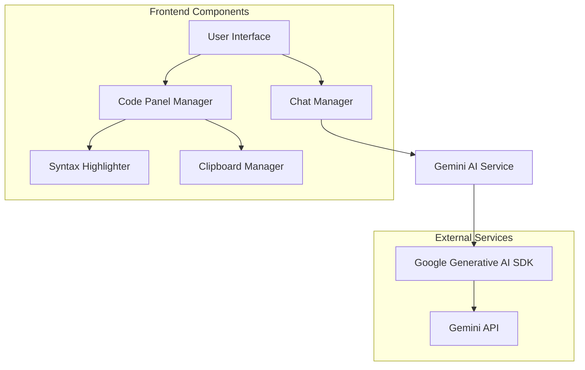

# Gemini Chat App

A single-page web application for chatting with Google's Gemini AI with automatic code parsing, syntax highlighting, and responsive design.

## Features

- **Chat Interface**: Send messages to Gemini AI and receive responses in a conversational format
- **Code Parsing**: Automatically extracts code blocks from AI responses into dedicated panels
- **Syntax Highlighting**: Supports highlighting for JavaScript, HTML, CSS, Python, and more
- **Copy to Clipboard**: One-click copying of code snippets
- **Responsive Design**: Works seamlessly on desktop, tablet, and mobile devices
- **Dark Theme**: Clean, minimalistic dark theme with smooth transitions
- **Error Handling**: Robust error handling with user-friendly messages and retry mechanisms

## Screenshots


## Getting Started

### Prerequisites

- Node.js (v14 or higher)
- Google Gemini API key (get one from [Google AI Studio](https://ai.google.dev/))

### Installation

1. Clone the repository:
   ```bash
   git clone https://github.com/yourusername/gemini-chat-app.git
   cd gemini-chat-app
   ```

2. Install dependencies:
   ```bash
   npm install
   ```

3. Start the development server:
   ```bash
   npm run dev
   ```

4. Open your browser and navigate to `http://localhost:3000`

5. Enter your Gemini API key when prompted

## Usage

1. Type your message in the input field at the bottom of the screen
2. Press Enter or click the send button to send your message
3. Wait for the AI to respond
4. Code blocks in the response will automatically be extracted into panels
5. Use the copy button on code panels to copy code to clipboard
6. Resize or collapse panels as needed
7. On mobile, use the toggle button to show/hide code panels

## Key Components

- **App Controller**: Main application orchestrator
- **Chat Manager**: Handles message flow and UI updates
- **Code Panel Manager**: Parses responses and manages code display
- **Gemini Service**: Wraps AI API interactions
- **Syntax Highlighter**: Provides language detection and syntax highlighting
- **Error Handler**: Centralizes error management and recovery

## Technical Details

### Architecture

The application follows a modular architecture with clear separation of concerns:



### Technologies Used

- **HTML5**: Semantic markup for structure
- **CSS3**: Custom styling with variables and responsive design
- **JavaScript (ES6+)**: Vanilla JavaScript with modules
- **Google Generative AI SDK**: For interacting with Gemini AI
- **Vitest**: For unit and integration testing

### Browser Support

- Chrome (latest)
- Firefox (latest)
- Safari (latest)
- Edge (latest)
- Mobile browsers (iOS Safari, Android Chrome)

## Development

### Project Structure

```
gemini-chat-app/
├── index.html          # Main HTML file
├── styles/
│   └── main.css        # CSS styles
├── js/
│   ├── app.js          # Main application controller
│   ├── chatManager.js  # Chat UI and message handling
│   ├── codePanelManager.js # Code panel creation and management
│   ├── errorHandler.js # Error handling and recovery
│   ├── geminiService.js # Gemini AI API integration
│   └── syntaxHighlighter.js # Code syntax highlighting
└── tests/
    ├── chatManager.test.js
    ├── codePanelManager.test.js
    ├── errorHandler.test.js
    ├── geminiService.test.js
    ├── integration.test.js
    ├── clipboard.test.js
    ├── responsiveLayout.test.js
    ├── syntaxHighlighter.test.js
    └── manual-tests.md
```

### Running Tests

```bash
# Run all tests
npm test

# Run tests in watch mode
npm run test:watch
```

## License

This project is licensed under the MIT License - see the LICENSE file for details.

## Acknowledgments

- Google Generative AI team for the Gemini API
- The open-source community for inspiration and tools